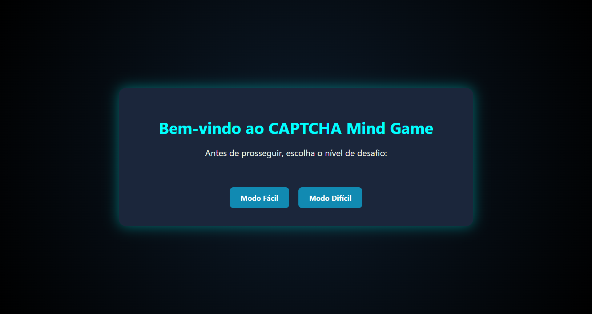

# CAPTCHA Mind Game

Um CAPTCHA em formato de mini-jogo lógico, feito com FastAPI, lógica cognitiva e visual imersivo. Agora com modo fácil/difícil, tempo limite e efeito de confetes ao vencer.

## Demonstração


## Objetivo
Desafiar o usuário com enigmas mentais e proteger sua aplicação contra bots com estilo. Um CAPTCHA que exige inteligência, não apenas cliques.

---

## Estrutura do projeto
```
captcha-mind-game/
├── app/
│   ├── main.py              # Entry point da aplicação
│   ├── logic.py             # Lógica dos desafios (easy/hard)
│   ├── templates/           # HTMLs do jogo
│   └── static/              # Estilo visual e animações
├── tests/
│   └── test_logic.py        # Testes unitários
├── requirements.txt         # Dependências
├── uvicorn.sh               # Script para rodar local
├── render.yaml              # Deploy automático na Render
├── .gitignore               # Boas práticas
└── README.md
```

## Como rodar localmente
```bash
git clone https://github.com/seunome/captcha-mind-game.git
cd captcha-mind-game
python -m venv venv
source venv/bin/activate
pip install -r requirements.txt
bash uvicorn.sh
```
Acesse: [http://localhost:8000](http://localhost:8000)

## Funcionalidades
- Mini-jogos com lógica proposicional
- Confetes animados ao acertar
- Timer regressivo de 40 segundos
- Botão para escolher entre modo fácil ou difícil
- Totalmente responsivo e animado com CSS

## Deploy gratuito na Render
1. Crie conta em https://render.com
2. Suba esse projeto no GitHub
3. Acesse New > Web Service
4. Conecte ao seu repositório e aceite o render.yaml

Ou configure manualmente:
- Build command: `pip install -r requirements.txt`
- Start command: `uvicorn app.main:app --host 0.0.0.0 --port 10000`

## Testes
```bash
PYTHONPATH=./ pytest tests/
```

## Inspiração
Mistura de lógica, design sci-fi e interatividade para desafiar bots e humanos com estilo. Ideal para portfólio, entrevistas ou proteção divertida de formulários.